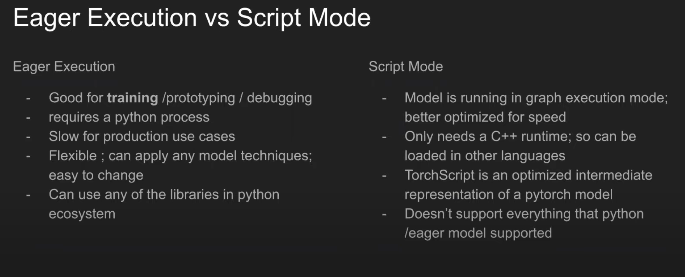

# Serving BERT Models in Production with TorchServe | PyData Global 2021 Notes

Presenters: Adway Dhillon and Nidhin Pattaiyii (Walmart MLEs - Search)

## Machine Learning at Walmart Search
- SpellCheck
- TypeAhead
- Related Search / Guided Navigation
- Query / Item Understanding
- Personalized Ranking

## Models in Prod
- Originally Tensorflow
- Serves BERT
- Pytorch/ONNX support
- SLA < 40ms

## Setup
- Repo: [Github Repo for BERT Torchserve | PyData](https://bit.ly/pytorch-workshop-2021)

- Dataset: [Amazon Berkeley Objects (ABO) Dataset](https://amazon-berkeley-objects.s3.amazonaws.com/index.html)

## Training
- HuggingFace
- Transformers (distil-bert-uncased)

## Post Training Optimization
Considering that the size of the models from the transformer trainings are considerably large, the models need to be optimized before using them in production.
- **Quantization**: Techniques for performing computations and storing tensors have at lower bit than floating point precision, reducing memory and compute time.
- INT8 computations is 2 to 4 times faster than FP32 with relatively low drop in accuracy.
- Types of Quantization available in PyTorch:
    - Dynamic Quantization
    - Static Quantization
    - Quantization Aware Training

- **Distillation**: Another technique employed in optimization where knowledge(weights and biases) from a big model(teacher) is transferred to a smaller model(student) with little to no significant loss in performance.

## Eager Execution vs Script Mode
